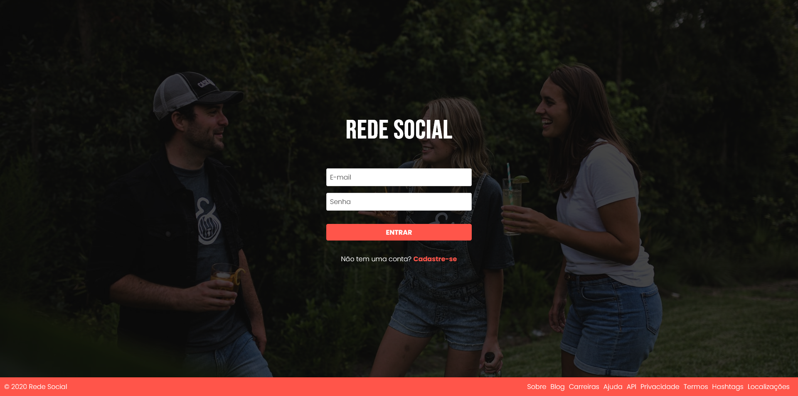
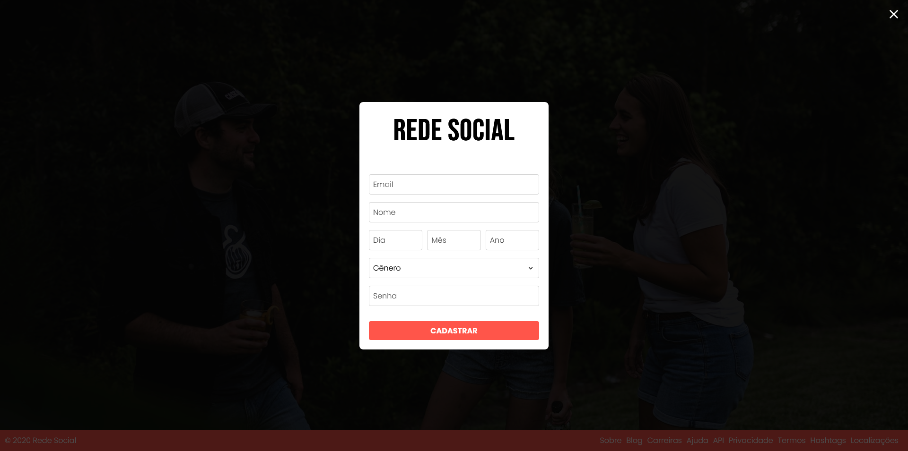
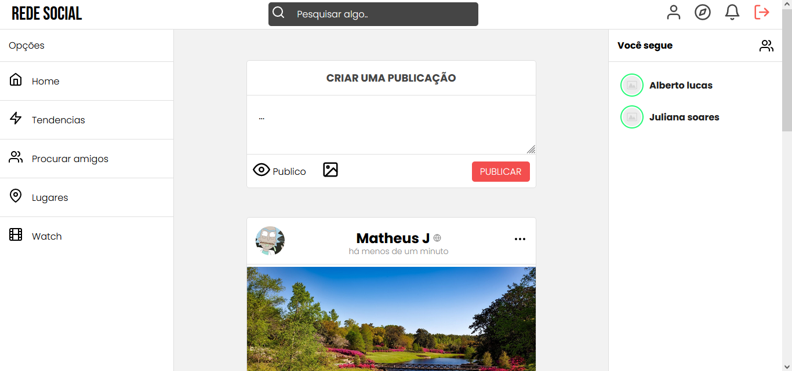
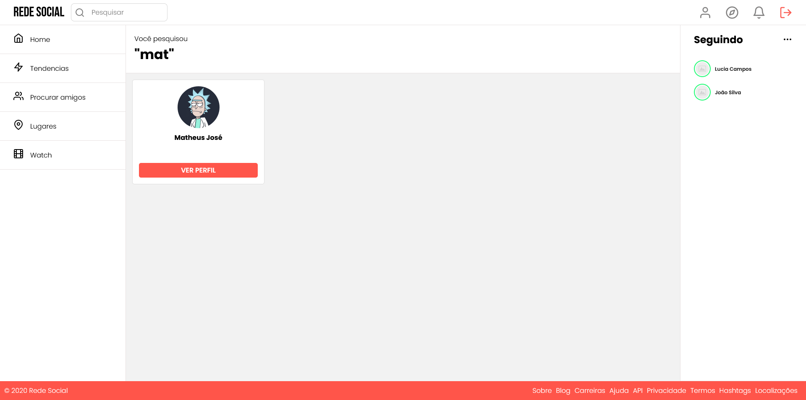
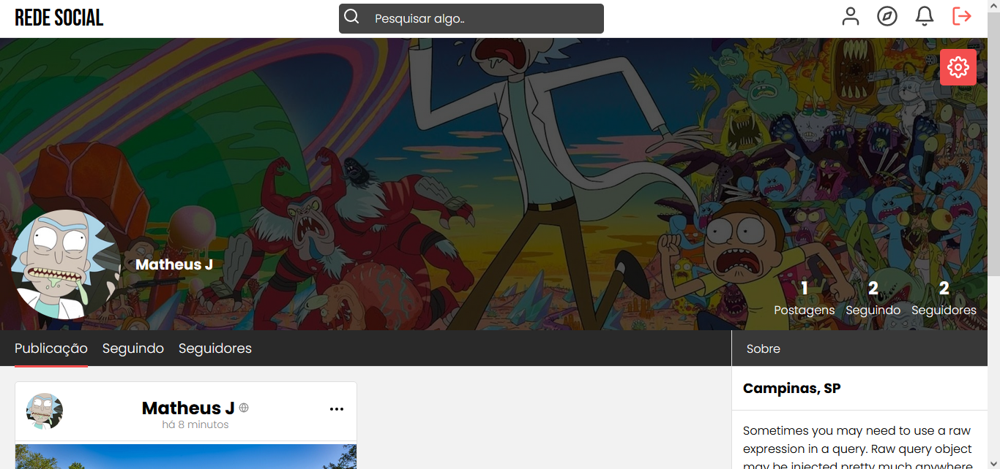
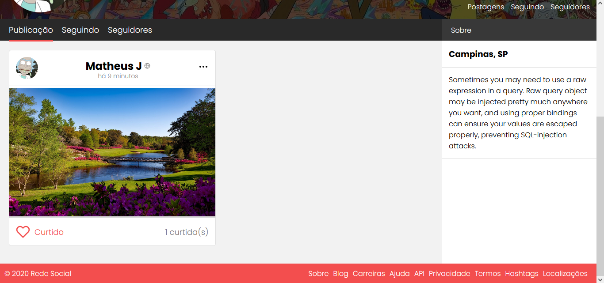

<h3 align="center">

<br>
Siga pessoas e acompanhe suas publicações
</h3>

---

## 👉 Indice

* [Sobre](#sobre)
* [Tecnologias](#tecnologias)
* [Requisitos](#requisitos)
* [Instalação](#instalacao)
* [Capturas de tela](#screenshot)

---

<a id="Sobre"></a>

## 😀 Sobre
Fiz esse projeto para colocar em pratica meus conhecimentos em HTML, CSS e JavaScript. O projeto é uma rede social nela voce pode:
- Seguir pessoas
- Publicar um texto
- Publicar uma foto
- Curtir publicações
- Personalizar perfil

---

<a id="tecnologias"></a>

## 🤩 Tecnologias usadas
- [Node](https://nodejs.org/en/)
- [SQLite](https://www.sqlite.org/docs.html)
- [React](https://pt-br.reactjs.org/)
- [Figma](https://www.figma.com)

---

## 😬 Requisitos:
- Ter instalado o Node.js
- Gerenciador de pacote NPM

---
<a id="instalacao"></a>

## ➡ Instalação
1: Clonar o projeto
```sh
  $ git clone https://github.com/matheusjos3/rede-social-rs.git 
```

2: Instalar as depedências
- Backend
```sh
  # Entrar na pasta backend
  $ cd backend

  # Usar o comando
  $ npm install
```
antes de iniciar o servidor, crie um arquivo .env na pasta backend
```sh
module.exports = {
    authSecret: 'chave qualquer'
}
```
por fim..
```sh
# Iniciar o servidor
  $ npm start
```
 
- Frontend
```sh
  # Entrar na pasta frontend
  $ cd frontend

  # Usar o comando
  $ npm install

  # iniciar aplicação
  $ npm start

  # Irá abrir automaticamente uma janela no seu navegador
  # Caso não aconteça digite a url: http://localhost:3000/
  ```
---

<a id="screenshot"></a>

## 💻 Capturas de tela
Tela inicial


Formulario de cadastro


Timeline


Tela de pesquisa


Tela de perfil


Tela de perfil (Publicações)


---
<h3 align="center">Desenvolvido com ❤ por Matheus José</h3>